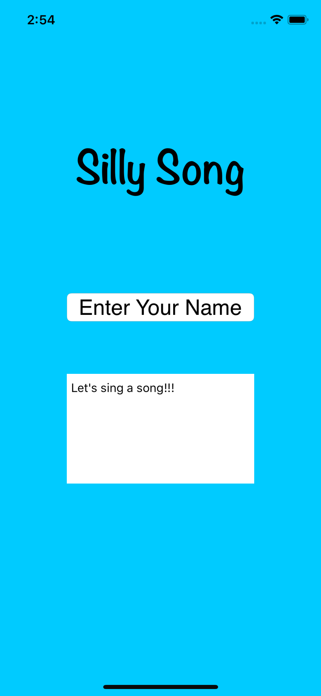
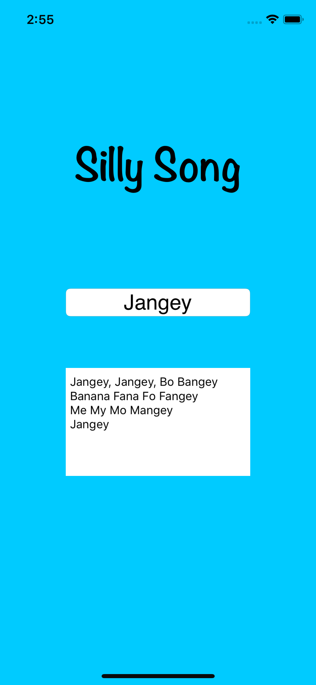

# SillySong
First IOS APP

Open the file in Xcode to test the app
- Type your name in the textfiled 
- Output: The song made by your name

## ScreenShot
Ask user to type their name:  

The result for the song:  

